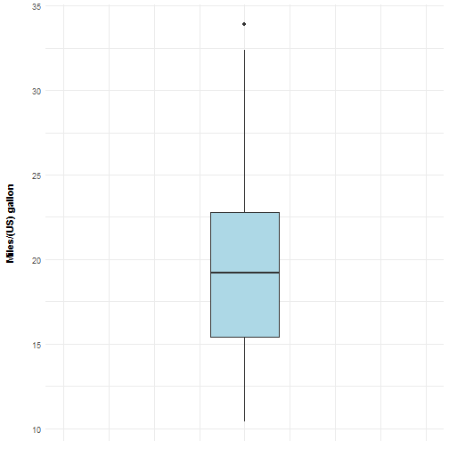
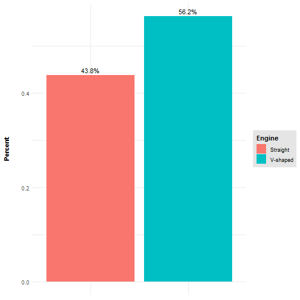
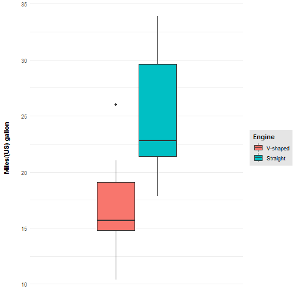
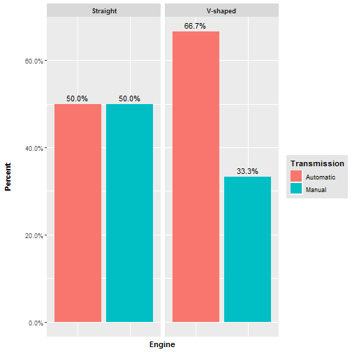
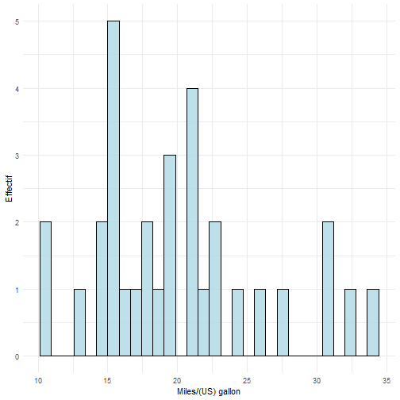
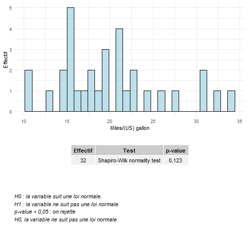
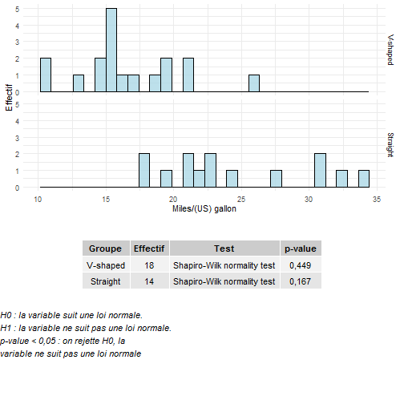

L'objectif de ce package est de regrouper des fonctions et méthodes qui permettent de décrire un jeu de données.  
Ce package s'appuit :

- Sur les fonctions de `base::` de R pour la partie statistique.
- Sur `ggplot2::` pour la partie graphique.
- Sur `rmarkdown::` et `officer::` pour le reporting.

# Installation
Pour installer le package, il faut avoir au prélable installé `devtools`.  
Une fois fait, le pakage s'installe grace à la fonction `devtools::install_github()`.

```r
# install.packages("devtools")
devtools::install_github("rgriffier/statsBordeaux")
```

# Mise à jour du package
Le package n'étant pas hébergé sur le CRAN, la mise à jour du package ne peut pas se faire à partir de la fonction classique `update.packages()`. Pour le mettre à jour, vous devez utiliser la fonction `statsBordeaux::updateStatsBordeaux()`.

```r
statsBordeaux::updateStatsBordeaux()
```

# Utilisation du package
## Chargement du package


```r
library(statsBordeaux, warn.conflicts = FALSE)
```

## Chargement des données
Ce tutoriel se base sur le dataset `mtcars` inclu dans R.

### Chargement du jeu de données
Dans ce jeu de données, les variables qualitatives (`vs` et `am`) sont codées en 0/1.


```r
## chargement du jeu de donnée
data(mtcars)

## affichage de la structure du data.frame
str(mtcars)
```

```
## 'data.frame':	32 obs. of  11 variables:
##  $ mpg : num  21 21 22.8 21.4 18.7 18.1 14.3 24.4 22.8 19.2 ...
##  $ cyl : num  6 6 4 6 8 6 8 4 4 6 ...
##  $ disp: num  160 160 108 258 360 ...
##  $ hp  : num  110 110 93 110 175 105 245 62 95 123 ...
##  $ drat: num  3.9 3.9 3.85 3.08 3.15 2.76 3.21 3.69 3.92 3.92 ...
##  $ wt  : num  2.62 2.88 2.32 3.21 3.44 ...
##  $ qsec: num  16.5 17 18.6 19.4 17 ...
##  $ vs  : num  0 0 1 1 0 1 0 1 1 1 ...
##  $ am  : num  1 1 1 0 0 0 0 0 0 0 ...
##  $ gear: num  4 4 4 3 3 3 3 4 4 4 ...
##  $ carb: num  4 4 1 1 2 1 4 2 2 4 ...
```

### Chargement des labels des modalitées des différentes variables qualitatives
Pour les variables qualitatives, on charge un data.frame de 3 colonnes :  
- `Variable` : nom de la variable, tel que renseigné dans le dataset.  
- `Modality` : nombre représentant la modalité, tel que renseigné dans le dataset.  
- `Label` : label de la modalité, tel que souhaité pour le rendu des résultats.


```r
## création du data.frame contenant les labels des différentes modalitées des variables qualitatives
labels <- data.frame(Variable = c("vs", "vs", "am", "am"), 
                     Modality = c(0, 1, 0, 1),
                     Label = c("V-shaped", "Straight", "Automatic", "Manual"))
labels
```

```
##   Variable Modality     Label
## 1       vs        0  V-shaped
## 2       vs        1  Straight
## 3       am        0 Automatic
## 4       am        1    Manual
```

## Data management
### ÉTAPE 1 : vérification du contenu du data.frame contenant les données à analyser
On vérifie que le data.frame du jeux de données ne contient que des nombre grace à la fonction `statsBordeaux::checkNotDigitInDataframe()`.  
Dans le cas où la fonction `statsBordeaux::checkNotDigitInDataframe()` renvoie `FALSE`, il est possible de récupérer un data.frame contenant la position des cellules contenant des éléments non-numériques en ajoutant le paramètre `returnError = TRUE`. La position de ces cellules est donnée au format Excel (ex : A2).


```r
## vérification que le jeu de donnée ne contient que des chiffres
statsBordeaux::checkNotDigitInDataframe(mtcars)
```

### ÉTAPE 2 : labélisation des modalité des variables qualiatives
Comme le data.frame d'entrée ne contient que des nombres, il faut labéliser les modalités des variables qualitatives.  
On effectue cette labélisation grâce à la fonction `statsBordeaux::setLabelToFactorLevels()` à partir du data.frame `labels` créé précédemment.  
Cette fonction gère à la fois :

- La conversion des variables présentes dans le data.frame `labels` en tant que `factor`.
- La labélisation des différentes modalitées de ces variables.

La fonction vérifie que les variables du fichier des labels sont bien dans le data.frame des données. Le cas échant, elle retourne une erreur identifiant le ou les variables présentes dans le data.frame des labels mais absente du data.frame des données. 


```r
## association à chaque modalité des variables qualitatives du label correspondant et conversion de ces variables en factor
labelledData <- statsBordeaux::setLabelToFactorLevels(mtcars, labels)
head(labelledData)
```

```
##                    mpg cyl disp  hp drat    wt  qsec       vs        am
## Mazda RX4         21.0   6  160 110 3.90 2.620 16.46 V-shaped    Manual
## Mazda RX4 Wag     21.0   6  160 110 3.90 2.875 17.02 V-shaped    Manual
## Datsun 710        22.8   4  108  93 3.85 2.320 18.61 Straight    Manual
## Hornet 4 Drive    21.4   6  258 110 3.08 3.215 19.44 Straight Automatic
## Hornet Sportabout 18.7   8  360 175 3.15 3.440 17.02 V-shaped Automatic
## Valiant           18.1   6  225 105 2.76 3.460 20.22 Straight Automatic
##                   gear carb
## Mazda RX4            4    4
## Mazda RX4 Wag        4    4
## Datsun 710           4    1
## Hornet 4 Drive       3    1
## Hornet Sportabout    3    2
## Valiant              3    1
```

### ÉTAPE 3 (optionnelle) : labellisation des variables
Il est possible d'associer à chaque variable du data.frame contenant le jeu de donnée un label (afin d'améliorer la sortie des résultats) grace à la fonction `statsBordeaux::setLabelToVariable()`.
Le label des variables est contenu dans un attribut `var_label`.


```r
## création du data.frame contenant le label de chaques variables
labelVariable <- data.frame(Variable = c("mpg", "cyl", "disp", "hp", "drat", "wt",
                                         "qsec", "vs", "am", "gear", "carb"),
                            Label = c("Miles/(US) gallon", "Number of cylinders", "Displacement (cu.in.)",
                                      "Gross horsepower ", "Rear axle ratio", "Weight (1000 lbs)",
                                      "1/4 mile time", "Engine", "Transmission", "Number of forward gears",
                                      "Number of carburetors"))

## labélisation des variables du data.frame
labelledData <- statsBordeaux::setLabelToVariable(labelledData, labelVariable)

## fonction pour récupérer les labels d'un data.frame labellisé
statsBordeaux::getLabelFromVariable(labelledData)
```

```
##  [1] "Miles/(US) gallon"       "Number of cylinders"    
##  [3] "Displacement (cu.in.)"   "Gross horsepower "      
##  [5] "Rear axle ratio"         "Weight (1000 lbs)"      
##  [7] "1/4 mile time"           "Engine"                 
##  [9] "Transmission"            "Number of forward gears"
## [11] "Number of carburetors"
```

```r
## attribut stockant le label d'une variable
nomVariable <- attributes(labelledData[, 1])$var_label
```

### ÉTAPE 4 : vérification de la structure finale du fichier à analyser
On vérifie la structure du data.frame contenant le dataset.  
Toutes les variables à analyser doivent être de classe  `numeric` (`integer` ou `double`) ou de classe `factor`.


```r
## description des méta-données
list_variableFormat <- do.call(rbind, (lapply(colnames(labelledData), function(x){
  varLabel <- attributes(labelledData[, x])$var_label
  if(is.null(varLabel)){
    varLabel <- NA
  }
  descVariable <- data.frame(VAR = x,
                             VAR_LABEL = varLabel,
                             CLASS = class(labelledData[, x]),
                             LEVELS = paste0(levels(labelledData[, x]), collapse = ", "))
  return(descVariable)
})))
list_variableFormat
```

```
##     VAR               VAR_LABEL   CLASS             LEVELS
## 1   mpg       Miles/(US) gallon numeric                   
## 2   cyl     Number of cylinders numeric                   
## 3  disp   Displacement (cu.in.) numeric                   
## 4    hp       Gross horsepower  numeric                   
## 5  drat         Rear axle ratio numeric                   
## 6    wt       Weight (1000 lbs) numeric                   
## 7  qsec           1/4 mile time numeric                   
## 8    vs                  Engine  factor V-shaped, Straight
## 9    am            Transmission  factor  Automatic, Manual
## 10 gear Number of forward gears numeric                   
## 11 carb   Number of carburetors numeric
```

## Statistiques descriptives
### Statistiques descriptives globales
#### Utilisation de la fonction pipe `%>%`

La fonction `statsBordeaux::describeDataFrame()` permet de décrire les variables qualitatives et quantitatives d'un data.frame. Elle peut s'utiliser avec les pipes `%>%` (package `dplyr`).

```r
# chargement de dplyr
library(dplyr)

# statistique descriptive sur l'ensemble du data.frame
description <- labelledData %>%
  statsBordeaux::describeDataFrame()

description[c(1:5, 36:39), ]
```

```
##             Variable       Modality      Description                  All
## 1  Miles/(US) gallon           <NA>             <NA>                 <NA>
## 2               <NA>           <NA>         N (m.d.)               32 (0)
## 3               <NA>           <NA>        Mean (SD)       20,091 (6,027)
## 4               <NA>           <NA> Median [Q1 ; Q3] 19,2 [15,425 ; 22,8]
## 5               <NA>           <NA>        Min ; Max          10,4 ; 33,9
## 36            Engine           <NA>             <NA>                 <NA>
## 37              <NA> All modalities     N (m.d. ; %)           32 (0 ; 0)
## 38              <NA>       V-shaped            N (%)           18 (56,25)
## 39              <NA>       Straight            N (%)           14 (43,75)
```

De la même manière, il est possible de réaliser une description graphique des données avec la fonction `statsBordeaux::getGraphicalDescription()`


```r
# statistique graphique sur l'ensemble du data.frame
graphicDescription <- labelledData %>%
  statsBordeaux::getGraphicalDescription()

## Variable quantitative : BOX PLOT
graphicDescription[[1]]
```

```
## $mpg
```



```r
## Variable qualitative : BAR PLOT
graphicDescription[[8]]
```

```
## $vs
```



#### Utilisateurs avancés, utilisation pas à pas
On créé un tableau de sortie vierge à partir de la fonction `statsBordeaux::createOutput()`. C'est ce dernier qui va contenir la description de nos variables.  
On réalise les statistiques descriptives des données avec les fonctions `statsBordeaux::statsQT()` et `statsBordeaux::statsQL()` (en fonction de la nature quantitative ou qualitative de la variable à décrire).


```r
## création du tableau de sortie vierge
description <-  statsBordeaux::createOutput()

## boucle qui va traiter chaque colonne du data.frame les unes après les autres
for(i in 1:ncol(labelledData)){
  # cas où la colonne en cours est de type quantitative
  if(is.numeric(labelledData[, i])){
    description <- statsBordeaux::statsQT(output = description,
                                          input = labelledData,
                                          variable = colnames(labelledData)[i])
  }
  # cas où la colonne en cours est de type qualitative
  else if(is.factor(labelledData[, i])){
    description <- statsBordeaux::statsQL(output = description,
                                          input = labelledData,
                                          variable = colnames(labelledData)[i])
  }
  # autre cas non pris en charge
  else {
    print(paste0("Variable '", colnames(labelledData[i]), "' non décrite (", class(labelledData[, i]), ")"))
  }
}

head(description, n = 5)
```

```
##            Variable Modality      Description                  All
## 1 Miles/(US) gallon     <NA>             <NA>                 <NA>
## 2              <NA>     <NA>         N (m.d.)               32 (0)
## 3              <NA>     <NA>        Mean (SD)       20,091 (6,027)
## 4              <NA>     <NA> Median [Q1 ; Q3] 19,2 [15,425 ; 22,8]
## 5              <NA>     <NA>        Min ; Max          10,4 ; 33,9
```

### Statistiques descriptives en fonction d'une variable qualitative de groupe
#### Utilisation de la fonction pipe `%>%`

La fonction `statsBordeaux::describeDataFrame()` permet également de réaliser les statistiques en fonction d'unevariable qualitative de groupe. Il suffit pour celà de renseigner le paramètre `group`.
On peut dans ce cas rajouter le paramètre `all = TRUE` afin afficher en plus une description globale des variables.


```r
# statistique comparative sur l'ensemble du data.frame
comp <- labelledData %>%
  statsBordeaux::describeDataFrame(group = "vs",
                                   all = TRUE)

comp[c(1:5, 36:39), ]
```

```
##             Variable       Modality      Description
## 1  Miles/(US) gallon           <NA>             <NA>
## 2               <NA>           <NA>         N (m.d.)
## 3               <NA>           <NA>        Mean (SD)
## 4               <NA>           <NA> Median [Q1 ; Q3]
## 5               <NA>           <NA>        Min ; Max
## 36      Transmission           <NA>             <NA>
## 37              <NA> All modalities     N (m.d. ; %)
## 38              <NA>      Automatic            N (%)
## 39              <NA>         Manual            N (%)
##                   V-shaped             Straight                  All Test
## 1                     <NA>                 <NA>                 <NA>   NA
## 2                   18 (0)               14 (0)               32 (0)   NA
## 3           16,617 (3,861)       24,557 (5,379)       20,091 (6,027)   NA
## 4  15,65 [14,775 ; 19,075] 22,8 [21,4 ; 29,625] 19,2 [15,425 ; 22,8]   NA
## 5                10,4 ; 26          17,8 ; 33,9          10,4 ; 33,9   NA
## 36                    <NA>                 <NA>                 <NA>   NA
## 37              18 (0 ; 0)           14 (0 ; 0)           32 (0 ; 0)   NA
## 38             12 (66,667)               7 (50)          19 (59,375)   NA
## 39              6 (33,333)               7 (50)          13 (40,625)   NA
##    p-value
## 1       NA
## 2       NA
## 3       NA
## 4       NA
## 5       NA
## 36      NA
## 37      NA
## 38      NA
## 39      NA
```

De la même manière, il est possible de réaliser une description graphique des données en fonction d'une variable qualitative de groupe en rajoutant le paramètre `group` à la fonction `statsBordeaux::getGraphicalDescription()`


```r
# statistique graphique sur l'ensemble du data.frame
graphicDescription <- labelledData %>%
  statsBordeaux::getGraphicalDescription(group = "vs")

## Variable quantitative : BOX PLOT
graphicDescription[[1]]
```

```
## $mpg
```



```r
## Variable qualitative : BAR PLOT
graphicDescription[[9]]
```

```
## $am
```


#### Utilisateurs avancés, utilisation pas à pas
On réalise les statistiques descriptives des données en fonction d'une variable qualitative de comparaison en rajoutant un paramètre `group` aux fonction `statsBordeaux::statsQL()` et `statsBordeaux::statsQT()`.
On peut dans ce cas rajouter le paramètre `all = TRUE` afin afficher une description globale des variables.


```r
## création du tableau de sortie vierge
comparaison <-  statsBordeaux::createOutput()

## on défini la variable de groupe
group <- "vs"

## boucle qui va traiter chaque colonne du data.frame les unes après les autres
for(i in 1:ncol(labelledData)){
  # on ne réalise pas la comparaison de la variable group avec elle-même
  if(colnames(labelledData)[i] != group){
    # cas où la colonne en cours est de type quantitative
    if(is.numeric(labelledData[, i])){
      comparaison <- statsBordeaux::statsQT(output = comparaison,
                                            input = labelledData,
                                            variable = colnames(labelledData)[i],
                                            group = group,
                                            all = TRUE)
    }
    # cas où la colonne en cours est de type qualitative
    else if(is.factor(labelledData[, i])){
      comparaison <- statsBordeaux::statsQL(output = comparaison,
                                            input = labelledData,
                                            variable = colnames(labelledData)[i],
                                            group = group,
                                            all = TRUE)
    }
    # autre cas non pris en charge
    else {
      print(paste0("Variable '", colnames(labelledData[i]), "' non décrite (", class(labelledData[, i]), ")"))
    }
  }
}

head(comparaison, n = 5)
```

```
##            Variable Modality      Description                V-shaped
## 1 Miles/(US) gallon     <NA>             <NA>                    <NA>
## 2              <NA>     <NA>         N (m.d.)                  18 (0)
## 3              <NA>     <NA>        Mean (SD)          16,617 (3,861)
## 4              <NA>     <NA> Median [Q1 ; Q3] 15,65 [14,775 ; 19,075]
## 5              <NA>     <NA>        Min ; Max               10,4 ; 26
##               Straight                  All Test p-value
## 1                 <NA>                 <NA>   NA      NA
## 2               14 (0)               32 (0)   NA      NA
## 3       24,557 (5,379)       20,091 (6,027)   NA      NA
## 4 22,8 [21,4 ; 29,625] 19,2 [15,425 ; 22,8]   NA      NA
## 5          17,8 ; 33,9          10,4 ; 33,9   NA      NA
```

## Statistiques comparatives

- Comparaison de fréquences :
    * Si tous les effectifs théoriques sont supérieurs ou égaux à 5, un Chi² est réalisé.
    * Si un des effectifs théoriques est inférieur à 5 mais qu'ils sont tous supérieurs ou égaux à 3, un Chi² avec correction de Yates est réalisé.
    * Sinon un test de Fisher est réalisé.
- Comparaison de paramètre quantitatifs :
    * Cas où la variable de groupe est composée de deux modalitées :
        + Si tous les effectifs sont supérieurs ou égaux à 30, l'hypothèse de normalité est considérée comme vraie. Un test de Student (ou un test de Welsh en fonction de l'égalité des variance entre les groupes) est réalisé. Dans le cas d'absence de variabilité au sein d'un ou des deux groupes, aucun test n'est réalisé.
        + Si un des effectifs est inférieur à 30, l'hypothèse de normalité n'est pas considérée comme vraie. Un test de Wilcoxon est réalisé.
    * Cas où la variable de groupe est composée de plus de deux modalitées :
        + Si tous les effectifs sont supérieurs ou égaux à 30, l'hypothèse de normalité est considérée vraie. Un test d'ANOVA est réalisé.
        + Si un des effectifs est inférieur à 30, l'hypothèse de normalité n'est pas considérée vraie. Un test non-paramétrique de Kruskal-Wallis est réalisé.

#### Utilisation de la fonction pipe `%>%`

On réalise les statistiques comparatives des données en fonction d'une variable qualitative de comparaison en associant au paramètre `group` le paramètre `p_value = TRUE` dans la fonction `statsBordeaux::describeDataFrame()`.


```r
# statistique comparative sur l'ensemble du data.frame
comp <- labelledData %>%
  statsBordeaux::describeDataFrame(group = "vs",
                                   p_value = TRUE)
comp[c(1:5, 36:39), ]
```

```
##             Variable       Modality      Description
## 1  Miles/(US) gallon           <NA>             <NA>
## 2               <NA>           <NA>         N (m.d.)
## 3               <NA>           <NA>        Mean (SD)
## 4               <NA>           <NA> Median [Q1 ; Q3]
## 5               <NA>           <NA>        Min ; Max
## 36      Transmission           <NA>             <NA>
## 37              <NA> All modalities                N
## 38              <NA>      Automatic            N (%)
## 39              <NA>         Manual            N (%)
##                   V-shaped             Straight All
## 1                     <NA>                 <NA>  NA
## 2                   18 (0)               14 (0)  NA
## 3           16,617 (3,861)       24,557 (5,379)  NA
## 4  15,65 [14,775 ; 19,075] 22,8 [21,4 ; 29,625]  NA
## 5                10,4 ; 26          17,8 ; 33,9  NA
## 36                    <NA>                 <NA>  NA
## 37              18 (0 ; 0)           14 (0 ; 0)  NA
## 38             12 (66,667)               7 (50)  NA
## 39              6 (33,333)               7 (50)  NA
##                                                 Test p-value
## 1  Wilcoxon rank sum test with continuity correction  <0,001
## 2                                               <NA>    <NA>
## 3                                               <NA>    <NA>
## 4                                               <NA>    <NA>
## 5                                               <NA>    <NA>
## 36                        Pearson's Chi-squared test   0,341
## 37                                              <NA>    <NA>
## 38                                              <NA>    <NA>
## 39                                              <NA>    <NA>
```

#### Utilisateurs avancés, utilisation pas à pas
On réalise les statistiques comparatives des données en fonction d'une variable qualitative de comparaison en associant au paramètre `group` le paramètre `p_value = TRUE` dans les fonctions `statsBordeaux::statsQL()` et `statsBordeaux::statsQT()`. Le test réalisé est choisi en fonction des conditions d'application des différents tests. 


```r
## création du tableau de sortie vierge
statsComparatives <-  statsBordeaux::createOutput()

## on défini la variable de groupe
group <- "vs"

## boucle qui va traiter chaque colonne du data.frame les unes après les autres
for(i in 1:ncol(labelledData)){
  # on ne réalise pas la comparaison de la variable group avec elle-même
  if(colnames(labelledData)[i] != group){
    # cas où la colonne en cours est de type quantitative
    if(is.numeric(labelledData[, i])){
      statsComparatives <- statsBordeaux::statsQT(output = statsComparatives,
                                                  input = labelledData,
                                                  variable = colnames(labelledData)[i],
                                                  group = group,
                                                  p_value = TRUE)
    }
    # cas où la colonne en cours est de type qualitative
    else if(is.factor(labelledData[, i])){
      statsComparatives <- statsBordeaux::statsQL(output = statsComparatives,
                                                  input = labelledData,
                                                  variable = colnames(labelledData)[i],
                                                  group = group,
                                                  p_value = TRUE)
    }
    # autre cas non pris en charge
    else {
      paste0(colnames(labelledData)[i], " n'a pas été décrite du fait de son type (", class(labelledData[, i]), ")")
    }
  }
}

head(statsComparatives, n = 5)
```

```
##            Variable Modality      Description                V-shaped
## 1 Miles/(US) gallon     <NA>             <NA>                    <NA>
## 2              <NA>     <NA>         N (m.d.)                  18 (0)
## 3              <NA>     <NA>        Mean (SD)          16,617 (3,861)
## 4              <NA>     <NA> Median [Q1 ; Q3] 15,65 [14,775 ; 19,075]
## 5              <NA>     <NA>        Min ; Max               10,4 ; 26
##               Straight All
## 1                 <NA>  NA
## 2               14 (0)  NA
## 3       24,557 (5,379)  NA
## 4 22,8 [21,4 ; 29,625]  NA
## 5          17,8 ; 33,9  NA
##                                                Test p-value
## 1 Wilcoxon rank sum test with continuity correction  <0,001
## 2                                              <NA>    <NA>
## 3                                              <NA>    <NA>
## 4                                              <NA>    <NA>
## 5                                              <NA>    <NA>
```

## Reporting
### Reporting avec `rmarkdown`
Dans un projet R Markdown `Knit to HTML`, vous pouvez ajouter facilement un tableau de donnée avec la fonction `statsBordeaux::addKable()`. Cette dernière génère un __tableau HTML__.   
La gestion des titre et des numéro de tableau se fait au niveau du document et non dans la fonction `statsBordeaux::addKable()`.

La génération de .pdf en LaTeX n'est actuellement pas prise en charge.


```r
statsBordeaux::addKable(description)
```

### Reporting avec `officier`
Le reporting utilise le package `officier`.  
Le reporting se base sur un template (document Word). Ce dernier peut contenir une page de garde et des styles. Ce sont les styles qui sont utilisées dans les différentes fonctions ci-dessous pour gérer la mise en page.  
Les styles sont disponibles via la fonction `styles_info(doc)` dans la colonne `style_name` et dépendent du template utilisé.


```r
## chargement du package officier
library(officer)

## création d'un document vierge
doc <- officer::read_docx()

## ajout d'une table des matières puis d'un saut de page
doc <- statsBordeaux::addTableOfContent(doc, title = "Table des matières", style = "Normal", level = 3)
doc <- statsBordeaux::addBreak(doc)

## ajout d'un titre et d'un sous-titre
doc <- statsBordeaux::addTextElement(doc, title = "Statistiques descriptives", style = "heading 1")
doc <- statsBordeaux::addTextElement(doc, title = "Statistiques descriptives du dataset mtcars ", style = "heading 2")
## ajout d'un tableau de sortie puis d'un saut de page
doc <- statsBordeaux::addTable(doc, table = description, title = "Description du dataset mtcars",
                               displayTestName = FALSE, modalitySize = 2, valueSize = 1.5)
doc <- statsBordeaux::addBreak(doc)

## ajout sous-titre puis d'un tableau de sortie
doc <- statsBordeaux::addTextElement(doc, title = "Statistiques descriptives du dataset mtcars en fonction de engine",
                                     style = "heading 2")
doc <- statsBordeaux::addTable(doc, table = comparaison, title = "Description du dataset mtcars en fonction de engine",
                               displayTestName = FALSE, modalitySize = 2, valueSize = 1.5)
## section en cours au format paysage
doc <- statsBordeaux::setLandscape(doc, add_break = TRUE)

## ajout titre puis d'un sous-titre puis d'un tableau de sortie (le tout au format paysage)
doc <- statsBordeaux::addTextElement(doc, title = "Statistiques comparatives", style = "heading 1")
doc <- statsBordeaux::addTextElement(doc, title = "Statistiques comparatives du dataset mtcars en fonction de engine",
                                     style = "heading 2")
doc <- statsBordeaux::addTable(doc, table = statsComparatives,
                               title = "Comparaison du dataset mtcars en fonction de engine",
                               displayTestName = TRUE, modalitySize = 2, valueSize = 1.5)
doc <- statsBordeaux::setLandscape(doc, add_break = FALSE)

## ajout d'une table des tableaux
doc <- statsBordeaux::addTableOfTables(doc, title = "Table des tableaux", style = "Normal")
## ajout d'une table des graphiques
doc <- statsBordeaux::addTableOfGraphics(doc, title = "Table des graphiques", style = "Normal")

## on sauvegarde le document dans le workspace
print(doc, target = 'stat.docx')
```

## Fonctions avancées
### Tests de normalité
Il est souvent interessant de s'interesser à la distribution des variables quantitatives afin de connaitre la meilleure façon de les décrire (utilisation de la moyenne ou médiane par exemple) et les test statistiques à appliquer.

La distribution que l'on va le plus souvent vouloir évaluer est la distribution normale.  
La fonction `statsBordeaux::checkNormality()` permet d'évaluer la normalité d'une variable de manière graphique et à l'aide de deux test statistiques (*Kolmogorov-Smirnov* ou *Shapiro-Wilk*).


```r
## évaluation graphique de la distribution de la variable 'mpg'
statsBordeaux::checkNormality(data = labelledData, variable = "mpg")
```

```
## [[1]]
## [[1]]$mpg
```



```r
## évaluation graphique et avec un test de Shapiro-Wilk de la distribution de la variable 'mpg'
statsBordeaux::checkNormality(data = labelledData, variable = "mpg", p_value = TRUE, method = 'Shapiro')
```

```
## [[1]]
## [[1]]$mpg
```



```r
## évaluation graphique et avec un test de Shapiro-Wilk de la distribution de la variable 'mpg' dans chacun des sous-groupe de 'vs'
statsBordeaux::checkNormality(data = labelledData, variable = "mpg", group = "vs", p_value = TRUE, method = 'Shapiro')
```

```
## [[1]]
## [[1]]$mpg
```



### Gestion des 'non-applicables'
La gestion des 'non-applicables' fait intervenir la fonction `statsBordeaux::manageNotApplicable()`.
Cette fonction prend 2 paramètres d'entrée :

- `df`, un data.frame, contenant le jeu de donnée à décrire.
- `notApplicableChar`, un vecteur de longueur 1 contenant la façon dont sont représentés les 'non-applicables' dans les données.

Cette fonction renvoie une liste de deux éléments :

1. Le data.frame d'entrée duquel ont été ôtés les 'non-applicable'
2. Une liste de vecteurs logiques :
- `TRUE` signifie que la ligne en cours, pour la variable considérée, doit être comptabilisée.
- `FALSE` signifie que la ligne en cours, pour la variable considérée, ne doit pas être comptabilitée ('non-applicable').


```r
data(mtcars)

## on créé une colonne qui contient le nombre de vitesse dans le cas d'une transmission manuelle, sinon qui contient "NonApp"
mtcars$nSpeed <- c(5, 6, 5, "NonApp", "NonApp", "NonApp", "NonApp", "NonApp",
                   "NonApp", "NonApp", "NonApp", "NonApp", "NonApp", "NonApp",
                   "NonApp", "NonApp", "NonApp", 6, 6, 6, "NonApp", "NonApp",
                   "NonApp", "NonApp", "NonApp", 5, NA, 6, 5, 6, 6, 5)

## on utilise la fonction manageNotApplicable() pour gérer les non-applicable,
## représentés ici par des 'NonApp'
notApplicable <- statsBordeaux::manageNotApplicable(mtcars, "NonApp")

## on récupère le data.frame sans les 'non-applicables'
mtcars <- notApplicable[[1]]

## on récupère la liste de vecteurs logiques contenant les lignes qui doivent être analysées.
applicable <- notApplicable[[2]]

## vérification que le jeu de donnée ne contient que des chiffres
onlyDigit <- statsBordeaux::checkNotDigitInDataframe(mtcars)

## labellisation des modalitées des variables qualitatives
# on rajoute les labels des modalités de la nouvelle variable qualitative
labels <- rbind(labels, data.frame(Variable = c("nSpeed", "nSpeed"),
                                   Modality = c(5, 6),
                                   Label = c("5 vitesses", "6 vitesses")))
# labellisation des modalitées des variables qualitatives
labelledData <- statsBordeaux::setLabelToFactorLevels(mtcars, labels)

## labélisation des variables du data.frame
labelVariable <- rbind(labelVariable,
                       data.frame(Variable = "nSpeed",
                                  Label = "Nombre de vitesses (boite manuelle)"))
labelledData <- statsBordeaux::setLabelToVariable(labelledData, labelVariable)

##----------------

## création du tableau de sortie vierge
descriptionNonAvailable <-  statsBordeaux::createOutput()

## boucle qui va traiter chaque colonne du data.frame les unes après les autres
for(i in 1:ncol(labelledData)){
  # cas où la colonne en cours est de type quantitative
  if(is.numeric(labelledData[, i])){
    descriptionNonAvailable <- statsBordeaux::statsQT(output = descriptionNonAvailable,
                                                      input = statsBordeaux::subset_withAttributes(
                                                        labelledData,
                                                        applicable[[colnames(labelledData)[i]]]),
                                                      variable = colnames(labelledData)[i])
  }
  # cas où la colonne en cours est de type qualitative
  else if(is.factor(labelledData[, i])){
    descriptionNonAvailable <- statsBordeaux::statsQL(output = descriptionNonAvailable,
                                                      input = statsBordeaux::subset_withAttributes(
                                                        labelledData,
                                                        applicable[[colnames(labelledData)[i]]]),
                                                      variable = colnames(labelledData)[i])
  }
  # autre cas non pris en charge
  else {
    print(paste0("Variable '", colnames(labelledData[i]), "' non décrite (", class(labelledData[, i]), ")"))
  }
}

descriptionNonAvailable[c(40:44, 55:57), ]
```

```
##                   Variable       Modality  Description            All
## 40            Transmission           <NA>         <NA>           <NA>
## 41                    <NA> All modalities N (m.d. ; %)     32 (0 ; 0)
## 42                    <NA>      Automatic        N (%)    19 (59,375)
## 43                    <NA>         Manual        N (%)    13 (40,625)
## 44 Number of forward gears           <NA>         <NA>           <NA>
## 55                    <NA> All modalities N (m.d. ; %) 12 (1 ; 7,692)
## 56                    <NA>     5 vitesses        N (%)     5 (41,667)
## 57                    <NA>     6 vitesses        N (%)     7 (58,333)
```
